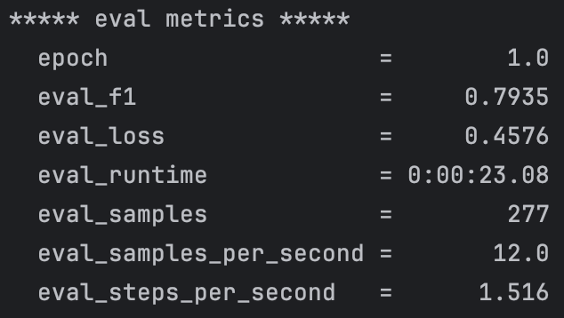
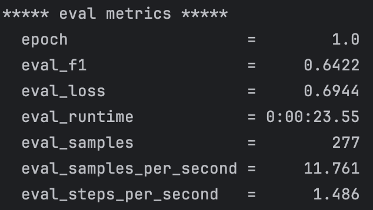

# CMPUT622
Final Project for Trustworthy ML

## Execution

## Baseline Execution
Example for execution without perturbations/collocations of any kind with the RTE dataset:
```
python run_glue.py \
  --model_name_or_path microsoft/deberta-v3-base \
  --task_name rte \
  --do_train \
  --do_eval \
  --max_seq_length 256 \
  --per_device_train_batch_size 8 \
  --learning_rate 2e-5 \
  --num_train_epochs 1 \
  --output_dir /tmp/rte/ \
  --overwrite_output_dir \
  --seed 124 \
```



## Perturbed Execution
Example for execution with a perturbed RTE train/validation set.
```
python run_glue.py \
  --model_name_or_path microsoft/deberta-v3-base \
  --do_train \
  --do_eval \
  --max_seq_length 256 \
  --per_device_train_batch_size 8 \
  --learning_rate 2e-5 \
  --num_train_epochs 1 \
  --output_dir /tmp/RTE_PERT/ \
  --overwrite_output_dir \
  --seed 124 \
  --train_file ./processed_datasets/rte_train.csv \
  --validation_file ./processed_datasets/rte_validation.csv
```



## References
- https://github.com/sjmeis/CLMLDP
- https://github.com/sjmeis/MLDP
- https://github.com/huggingface/transformers/tree/main/examples/pytorch/text-classification
- https://www.youtube.com/watch?v=fDzCBKArdYg
- https://huggingface.co/docs/transformers/installation#install-from-source
- https://github.com/protocolbuffers/protobuf/tree/main/python#installation

## Notes
To run CollocationExtractor and DatasetPerturbation you will need to have a local copy of their models and also the data.zip file that contains bigrams and trigrams from their repository. Not included in this repo since they're large files.

## TODOs
- [ ] Convert other perturbed datasets from pkl to csv. 
- [ ] Run baseline/perturbed results of the other datasets, we use the following three seeds (124, 34589, 98926). The paper did three runs and averaged F1.
- [ ] Double check if perturbations were done properly (why our validation is higher for RTE?)
